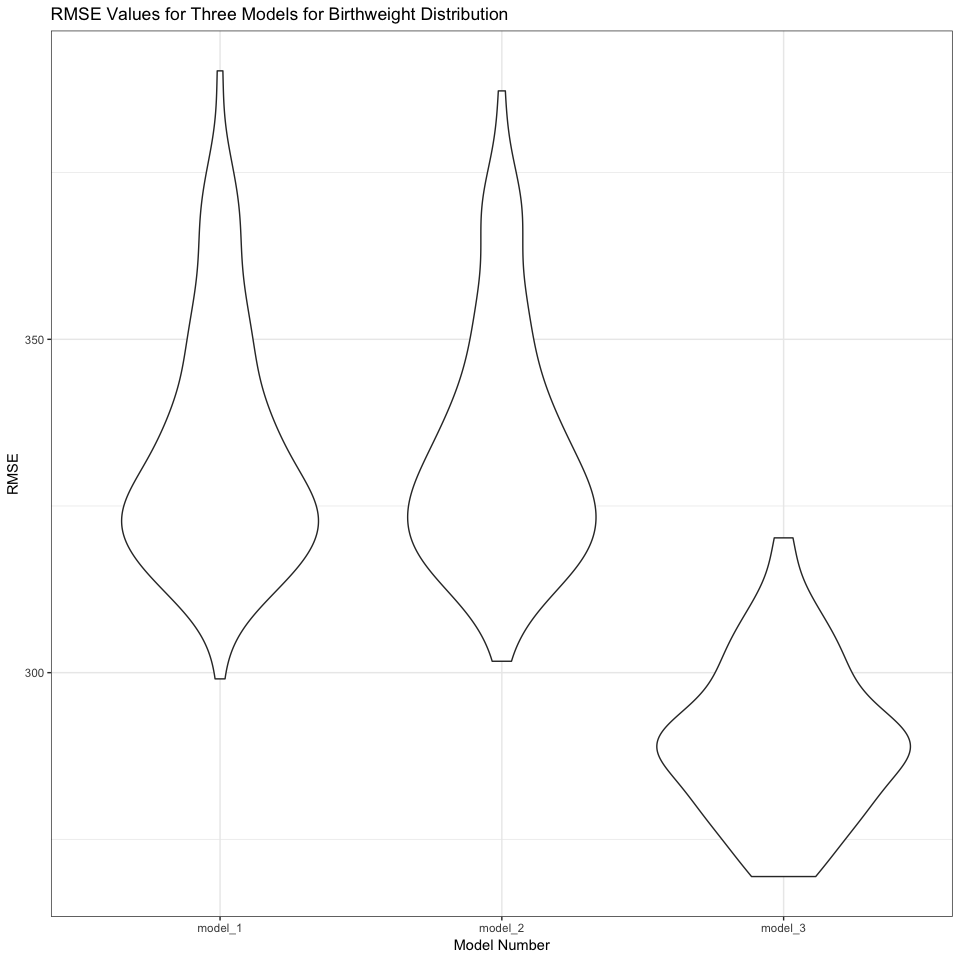

Homework \#6
================
Diana Ballesteros Gonzalez
11/27/2018

``` r
## Loading the packages
library(tidyverse)
```

    ## ── Attaching packages ────────────────────────────────────────────────────── tidyverse 1.2.1 ──

    ## ✔ ggplot2 3.0.0     ✔ purrr   0.2.5
    ## ✔ tibble  1.4.2     ✔ dplyr   0.7.6
    ## ✔ tidyr   0.8.1     ✔ stringr 1.3.1
    ## ✔ readr   1.1.1     ✔ forcats 0.3.0

    ## ── Conflicts ───────────────────────────────────────────────────────── tidyverse_conflicts() ──
    ## ✖ dplyr::filter() masks stats::filter()
    ## ✖ dplyr::lag()    masks stats::lag()

``` r
library(purrr)
library(modelr)
library(mgcv)
```

    ## Loading required package: nlme

    ## 
    ## Attaching package: 'nlme'

    ## The following object is masked from 'package:dplyr':
    ## 
    ##     collapse

    ## This is mgcv 1.8-25. For overview type 'help("mgcv-package")'.

``` r
knitr::opts_chunk$set(
  fig.width = 10,
  fig.asp = 1.0,
  out.width = "90%"
)

set.seed(1)

theme_set(theme_bw() + theme(legend.position = "bottom"))
```

### **Problem 1**

``` r
## Import data 
homicide_data = 
  read_csv("https://raw.githubusercontent.com/washingtonpost/data-homicides/master/homicide-data.csv") %>% 
  janitor::clean_names() %>% 
  mutate(city_state = paste(city, state, sep = ", "), 
         resolved = as.numeric(disposition == "Closed by arrest"), 
         victim_age = as.numeric(victim_age),
         victim_race = ifelse(victim_race == "White", "White", "Non-White"), 
         victim_race = fct_relevel(victim_race, "White")) %>% 
  filter(city_state != "Dallas, TX" & city_state != "Phoenix, AZ" & 
         city_state != "Kansas City, MO" & city_state != "Tulsa, AL") %>% 
  select(city_state, resolved, victim_age, victim_race, victim_sex)
```

    ## Parsed with column specification:
    ## cols(
    ##   uid = col_character(),
    ##   reported_date = col_integer(),
    ##   victim_last = col_character(),
    ##   victim_first = col_character(),
    ##   victim_race = col_character(),
    ##   victim_age = col_character(),
    ##   victim_sex = col_character(),
    ##   city = col_character(),
    ##   state = col_character(),
    ##   lat = col_double(),
    ##   lon = col_double(),
    ##   disposition = col_character()
    ## )

    ## Warning in evalq(as.numeric(victim_age), <environment>): NAs introduced by
    ## coercion

``` r
## Used the glm function to fit a logisitic regression with resolved vs unresolved as the outcome and victim age, sex and race (as just defined) as predictors. 
fit_logistic = 
  homicide_data %>% 
  filter(city_state == "Baltimore, MD") %>% 
  glm(resolved ~ victim_age + victim_race + victim_sex, 
      data = ., 
      family = binomial())

fit_logistic %>% 
  broom::tidy() %>% 
  filter(term == "victim_raceNon-White") %>% 
  mutate(OR = exp(estimate), 
         lower_limit = exp(estimate - 1.96*std.error), 
         upper_limit = exp(estimate + 1.96*std.error)) %>%
  select(OR, lower_limit, upper_limit) %>% 
  knitr::kable(digits = 3)
```

|     OR|  lower\_limit|  upper\_limit|
|------:|-------------:|-------------:|
|  0.441|         0.313|          0.62|

``` r
nest_glm_res =
  homicide_data %>% 
  group_by(city_state) %>% 
  nest() %>% 
  mutate(models = map(data, ~glm(resolved ~  victim_race + victim_age + victim_sex, 
                           data = .x, family = binomial)),
         models = map(models, broom::tidy)) %>% 
  select(-data) %>% 
  unnest() %>% 
  janitor::clean_names() %>% 
  mutate(OR = exp(estimate), 
         lower_limit = exp(estimate - 1.96 * std_error), 
         upper_limit = exp(estimate + 1.96 * std_error)) %>% 
  filter(term == "victim_raceNon-White") %>% 
  select(city_state, term, OR, lower_limit, upper_limit)

nest_glm_res %>% 
  knitr::kable(digits = 3)
```

| city\_state        | term                  |     OR|  lower\_limit|  upper\_limit|
|:-------------------|:----------------------|------:|-------------:|-------------:|
| Albuquerque, NM    | victim\_raceNon-White |  0.741|         0.451|         1.218|
| Atlanta, GA        | victim\_raceNon-White |  0.753|         0.432|         1.313|
| Baltimore, MD      | victim\_raceNon-White |  0.441|         0.313|         0.620|
| Baton Rouge, LA    | victim\_raceNon-White |  0.668|         0.313|         1.425|
| Birmingham, AL     | victim\_raceNon-White |  1.039|         0.615|         1.756|
| Boston, MA         | victim\_raceNon-White |  0.115|         0.047|         0.278|
| Buffalo, NY        | victim\_raceNon-White |  0.390|         0.213|         0.715|
| Charlotte, NC      | victim\_raceNon-White |  0.558|         0.321|         0.969|
| Chicago, IL        | victim\_raceNon-White |  0.562|         0.431|         0.733|
| Cincinnati, OH     | victim\_raceNon-White |  0.318|         0.184|         0.551|
| Columbus, OH       | victim\_raceNon-White |  0.855|         0.634|         1.152|
| Denver, CO         | victim\_raceNon-White |  0.602|         0.359|         1.009|
| Detroit, MI        | victim\_raceNon-White |  0.651|         0.488|         0.869|
| Durham, NC         | victim\_raceNon-White |  1.003|         0.404|         2.489|
| Fort Worth, TX     | victim\_raceNon-White |  0.838|         0.555|         1.266|
| Fresno, CA         | victim\_raceNon-White |  0.448|         0.231|         0.870|
| Houston, TX        | victim\_raceNon-White |  0.873|         0.699|         1.090|
| Indianapolis, IN   | victim\_raceNon-White |  0.505|         0.382|         0.667|
| Jacksonville, FL   | victim\_raceNon-White |  0.658|         0.502|         0.862|
| Las Vegas, NV      | victim\_raceNon-White |  0.755|         0.586|         0.973|
| Long Beach, CA     | victim\_raceNon-White |  0.794|         0.388|         1.626|
| Los Angeles, CA    | victim\_raceNon-White |  0.666|         0.483|         0.918|
| Louisville, KY     | victim\_raceNon-White |  0.392|         0.259|         0.593|
| Memphis, TN        | victim\_raceNon-White |  0.782|         0.524|         1.168|
| Miami, FL          | victim\_raceNon-White |  0.576|         0.377|         0.880|
| Milwaukee, wI      | victim\_raceNon-White |  0.632|         0.403|         0.991|
| Minneapolis, MN    | victim\_raceNon-White |  0.646|         0.345|         1.209|
| Nashville, TN      | victim\_raceNon-White |  0.899|         0.653|         1.236|
| New Orleans, LA    | victim\_raceNon-White |  0.466|         0.295|         0.737|
| New York, NY       | victim\_raceNon-White |  0.531|         0.279|         1.011|
| Oakland, CA        | victim\_raceNon-White |  0.213|         0.104|         0.435|
| Oklahoma City, OK  | victim\_raceNon-White |  0.681|         0.478|         0.971|
| Omaha, NE          | victim\_raceNon-White |  0.169|         0.094|         0.305|
| Philadelphia, PA   | victim\_raceNon-White |  0.644|         0.486|         0.852|
| Pittsburgh, PA     | victim\_raceNon-White |  0.282|         0.161|         0.493|
| Richmond, VA       | victim\_raceNon-White |  0.447|         0.162|         1.238|
| San Antonio, TX    | victim\_raceNon-White |  0.689|         0.461|         1.030|
| Sacramento, CA     | victim\_raceNon-White |  0.781|         0.449|         1.359|
| Savannah, GA       | victim\_raceNon-White |  0.596|         0.280|         1.270|
| San Bernardino, CA | victim\_raceNon-White |  0.880|         0.393|         1.972|
| San Diego, CA      | victim\_raceNon-White |  0.483|         0.298|         0.785|
| San Francisco, CA  | victim\_raceNon-White |  0.458|         0.290|         0.723|
| St. Louis, MO      | victim\_raceNon-White |  0.577|         0.406|         0.820|
| Stockton, CA       | victim\_raceNon-White |  0.376|         0.196|         0.719|
| Tampa, FL          | victim\_raceNon-White |  1.159|         0.587|         2.288|
| Tulsa, OK          | victim\_raceNon-White |  0.602|         0.413|         0.879|
| Washington, DC     | victim\_raceNon-White |  0.510|         0.258|         1.010|

``` r
nest_glm_res %>% 
  arrange(desc(OR)) %>% 
  mutate(city_state = fct_inorder(city_state)) %>% 
  ggplot(aes(x = city_state, y = OR)) + 
  geom_point() + 
  geom_errorbar(aes(ymax = lower_limit, ymin = upper_limit)) +
  labs(
    x = "Location (City & State)", 
    y = "Estimated Odds Ratio of Resolved Cases for Non-Whites Compared to Whites", 
    title = "Estimated Odds Ratio of Resolved Homicide Cases for Non-Whites Compared to Whites throughout the United Sates"
  ) +
  theme(axis.text.x = element_text(angle = 80, hjust = 1))
```


Plot Commentary:

### **Problem 2**

Load and clean the data for regression analysis (i.e. convert numeric to factor where appropriate, check for missing data, etc.).

Propose a regression model for birthweight. This model may be based on a hypothesized structure for the factors that underly birthweight, on a data-driven model-building process, or a combination of the two. Describe your modeling process and show a plot of model residuals against fitted values – use add\_predictions and add\_residuals in making this plot.

Compare your model to two others:

One using length at birth and gestational age as predictors (main effects only) One using head circumference, length, sex, and all interactions (including the three-way interaction) between these Make this comparison in terms of the cross-validated prediction error; use crossv\_mc and functions in purrr as appropriate.

Note that although we expect your model to be reasonable, model building itself is not a main idea of the course and we don’t necessarily expect your model to be “optimal”.

``` r
## Import the data
birthweight = 
  read_csv(file = "./data/birthweight.csv") %>% 
  janitor::clean_names() %>% 
  mutate(
    babysex = case_when(
      babysex == 1 ~ "male",
      babysex == 2 ~ "female"), 
    babysex = fct_relevel(babysex, "male"), 
    
    frace = case_when(
      frace == 1 ~ "White", 
      frace == 2 ~ "Black", 
      frace == 3 ~ "Asian", 
      frace == 4 ~ "Puerto Rican", 
      frace == 8 ~ "Other", 
      frace == 9 ~ "Unknown"),
    frace = fct_relevel(frace, "White"), 
    
    malform = case_when(
      malform == 0 ~ "absent",
      malform == 1 ~ "present"), 
    malform = fct_relevel(malform, "absent"), 
    
    mrace = case_when(
      mrace == 1 ~ "White", 
      mrace == 2 ~ "Black", 
      mrace == 3 ~ "Asian", 
      mrace == 4 ~ "Puerto Rican", 
      mrace == 8 ~ "Other", 
      mrace == 9 ~ "Unknown"), 
    mrace = fct_relevel(mrace, "White")
    )
```

    ## Parsed with column specification:
    ## cols(
    ##   .default = col_integer(),
    ##   gaweeks = col_double(),
    ##   ppbmi = col_double(),
    ##   smoken = col_double()
    ## )

    ## See spec(...) for full column specifications.

Description of the modeling process:

-   Mother's race, mother's age, and the the length of the baby are some factors that could potentially affect the baby's birthweight.

``` r
## Need to add labels and make it pretty 
model_1 = lm(bwt ~ mrace + blength + momage, data = birthweight)

model_1 %>% 
  broom::tidy() %>% 
  knitr::kable(digits = 3)
```

| term              |   estimate|  std.error|  statistic|  p.value|
|:------------------|----------:|----------:|----------:|--------:|
| (Intercept)       |  -3540.020|     99.553|    -35.559|    0.000|
| mraceAsian        |   -106.868|     51.516|     -2.074|    0.038|
| mraceBlack        |   -161.257|     11.328|    -14.235|    0.000|
| mracePuerto Rican |   -108.760|     22.686|     -4.794|    0.000|
| blength           |    133.865|      1.890|     70.832|    0.000|
| momage            |      3.578|      1.400|      2.556|    0.011|

``` r
modelr::add_residuals(birthweight, model_1)
```

    ## # A tibble: 4,342 x 21
    ##    babysex bhead blength   bwt delwt fincome frace gaweeks malform menarche
    ##    <fct>   <int>   <int> <int> <int>   <int> <fct>   <dbl> <fct>      <int>
    ##  1 female     34      51  3629   177      35 White    39.9 absent        13
    ##  2 male       34      48  3062   156      65 Black    25.9 absent        14
    ##  3 female     36      50  3345   148      85 White    39.9 absent        12
    ##  4 male       34      52  3062   157      55 White    40   absent        14
    ##  5 female     34      52  3374   156       5 White    41.6 absent        13
    ##  6 male       33      52  3374   129      55 White    40.7 absent        12
    ##  7 female     33      46  2523   126      96 Black    40.3 absent        14
    ##  8 female     33      49  2778   140       5 White    37.4 absent        12
    ##  9 male       36      52  3515   146      85 White    40.3 absent        11
    ## 10 male       33      50  3459   169      75 Black    40.7 absent        12
    ## # ... with 4,332 more rows, and 11 more variables: mheight <int>,
    ## #   momage <int>, mrace <fct>, parity <int>, pnumlbw <int>, pnumsga <int>,
    ## #   ppbmi <dbl>, ppwt <int>, smoken <dbl>, wtgain <int>, resid <dbl>

``` r
modelr::add_predictions(birthweight, model_1)
```

    ## # A tibble: 4,342 x 21
    ##    babysex bhead blength   bwt delwt fincome frace gaweeks malform menarche
    ##    <fct>   <int>   <int> <int> <int>   <int> <fct>   <dbl> <fct>      <int>
    ##  1 female     34      51  3629   177      35 White    39.9 absent        13
    ##  2 male       34      48  3062   156      65 Black    25.9 absent        14
    ##  3 female     36      50  3345   148      85 White    39.9 absent        12
    ##  4 male       34      52  3062   157      55 White    40   absent        14
    ##  5 female     34      52  3374   156       5 White    41.6 absent        13
    ##  6 male       33      52  3374   129      55 White    40.7 absent        12
    ##  7 female     33      46  2523   126      96 Black    40.3 absent        14
    ##  8 female     33      49  2778   140       5 White    37.4 absent        12
    ##  9 male       36      52  3515   146      85 White    40.3 absent        11
    ## 10 male       33      50  3459   169      75 Black    40.7 absent        12
    ## # ... with 4,332 more rows, and 11 more variables: mheight <int>,
    ## #   momage <int>, mrace <fct>, parity <int>, pnumlbw <int>, pnumsga <int>,
    ## #   ppbmi <dbl>, ppwt <int>, smoken <dbl>, wtgain <int>, pred <dbl>

``` r
birthweight %>% 
  add_residuals(model_1) %>%
  add_predictions(model_1) %>% 
  ggplot(aes(x = pred, y = resid)) + 
  geom_point() + 
  labs(
    x = "Predictive Values", 
    y = "Residual Values", 
    title = "Predictive Values vs. Residuals Values for Model 1"
  ) 
```


``` r
## One using length at birth and gestational age as predictors (main effects only)
model_2 = lm(bwt ~ blength + gaweeks, data = birthweight) 

model_2 %>% 
  broom::tidy() %>% 
  knitr::kable(digits = 3)
```

| term        |   estimate|  std.error|  statistic|  p.value|
|:------------|----------:|----------:|----------:|--------:|
| (Intercept) |  -4347.667|     97.958|    -44.383|        0|
| blength     |    128.556|      1.990|     64.604|        0|
| gaweeks     |     27.047|      1.718|     15.744|        0|

``` r
##One using head circumference, length, sex, and all interactions (including the three-way interaction) between these
model_3 = lm(bwt ~ bhead + blength + babysex + bhead * blength + bhead * babysex + blength * babysex + bhead * blength * babysex, data = birthweight)

model_3 %>% 
  broom::tidy() %>% 
  knitr::kable(digits = 3)
```

| term                        |   estimate|  std.error|  statistic|  p.value|
|:----------------------------|----------:|----------:|----------:|--------:|
| (Intercept)                 |  -7176.817|   1264.840|     -5.674|    0.000|
| bhead                       |    181.796|     38.054|      4.777|    0.000|
| blength                     |    102.127|     26.212|      3.896|    0.000|
| babysexfemale               |   6374.868|   1677.767|      3.800|    0.000|
| bhead:blength               |     -0.554|      0.780|     -0.710|    0.478|
| bhead:babysexfemale         |   -198.393|     51.092|     -3.883|    0.000|
| blength:babysexfemale       |   -123.773|     35.119|     -3.524|    0.000|
| bhead:blength:babysexfemale |      3.878|      1.057|      3.670|    0.000|

``` r
cv_df =
 crossv_mc(birthweight, 100)

cv_df = 
  cv_df %>% 
  mutate(model_1 = map(train, ~lm(bwt ~ mrace + blength + momage, data = .x)),
         model_2 = map(train, ~lm(bwt ~ blength + gaweeks, data = .x)),
         model_3 = map(train, ~lm(bwt ~ bhead + blength + babysex + bhead * blength + bhead * babysex + blength * babysex + bhead * blength * babysex, data = .x))) %>% 
  mutate(rmse_model_1 = map2_dbl(model_1, test, ~rmse(model = .x, data = .y)),
         rmse_model_2 = map2_dbl(model_2, test, ~rmse(model = .x, data = .y)),
         rmse_model_3 = map2_dbl(model_3, test, ~rmse(model = .x, data = .y)))

cv_df %>% 
  select(starts_with("rmse")) %>% 
  gather(key = model, value = rmse) %>% 
  mutate(model = str_replace(model, "rmse_", ""),
         model = fct_inorder(model)) %>% 
  ggplot(aes(x = model, y = rmse)) + 
  geom_violin() + 
  labs(
    x = "Model Number", 
    y = "RMSE", 
    title = "RMSE Values for Three Models for Birthweight Distribution"
  ) 
```


